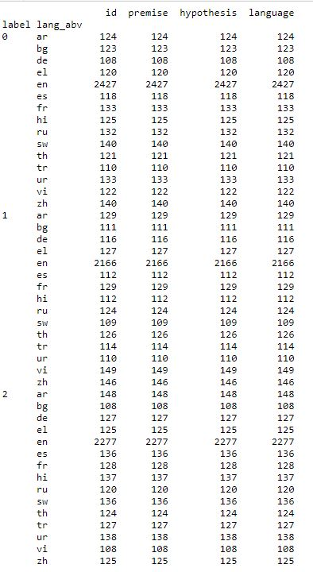
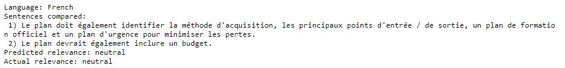
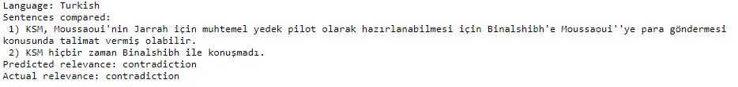
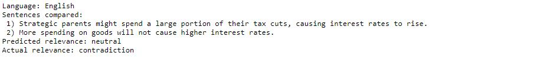
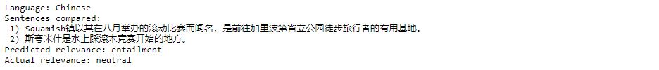
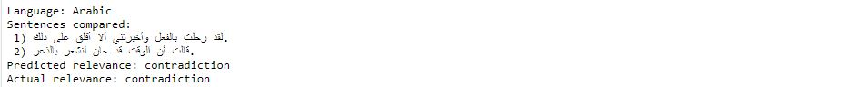

# BERT - Natural Language Inferencing

## Index

1. [BERT and Dataset used](#Brief)
2. [Overview of folder structure](#overview)
3. [Overview of key findings from the EDA conducted](#key-finding)
4. [Evaluation of the model](#model-evaluation)
5. [References](#references)


## <a name='brief'>1. BERT and Dataset used</a>

BERT stands for Bidirectional Encoder Representation from Transformers and is used to apply bidirectional training to language modelling.

A pre-trained BERT multilingual model is used from Huggingface and fine-tuned with a LSTM model to detect contradiction and entailment.

The dataset contains premise-hypothesis pairs in fifteen different languages, including: Arabic, Bulgarian, Chinese, German, Greek, English, Spanish, French, Hindi, Russian, Swahili, Thai, Turkish, Urdu, and Vietnamese.

## <a name='overview'>2. Overview of folder structure</a>

An overview of the folder structure is as below:


```flow
|-- imgs
|-- test 
|   |-- test.csv
|-- train 
|   |-- train.csv
|-- README.md
|-- Multilingual Contradiction and Entailment_rev.03_train_eval.ipynb
```


## <a name='key-finding'>3. Key findings from the EDA conducted</a>

The dataset is relatively balanced among inference types (i.e.premise, hypothesis) and languages (with the exception of English).




## <a name='model-evaluation'>4. Evaluation of models developed</a>

The BERT Multilingual model and LSTM was trained for 2 epochs and achieved val-acc of 0.4054


A sample inference prediction from French sentences:



A sample inference prediction from Turkish sentences:



A sample inference prediction from English sentences:



A sample inference prediction from Chinese sentences:



A sample inference prediction from Arabic sentences:



The model may be further improved by using a better pre-trained model (e.g. XLM-Roberta), or by training for more epoches and modifying the learning rates.

## <a name='references'>5. References</a>
1. Pre-trained BERT model: https://huggingface.co/
2. Dataset: https://www.kaggle.com/c/contradictory-my-dear-watson/data
3. Code Reference: https://keras.io/examples/nlp/semantic_similarity_with_bert/